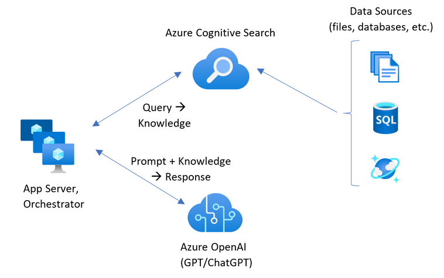

# Hello Sika

Welcome to the new and dancy assistant which gives you the information you need whenever you need it.

You can try it yourself at https://app-backend-t5wloy75g44ny.azurewebsites.net/.

Hello Sika uses Azure cognitive search with OpenAI to provide accurate results, and Azure Web App Service to provide the functionality.

Inspired by an example from Microsoft, the system allows us to provide a quick and easy way to master a large amount of (private) corporate data from various systems to get the right information in time. Those systems, being the data sources for the assistant, can be connected fast and efficiently thanks to the wide range of options offered by the Azure cloud.
